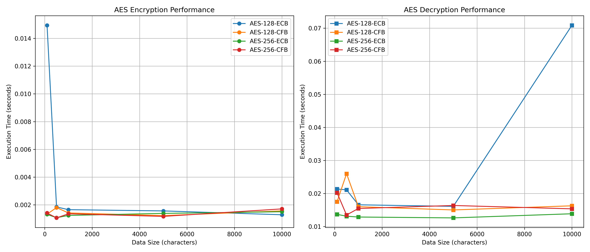
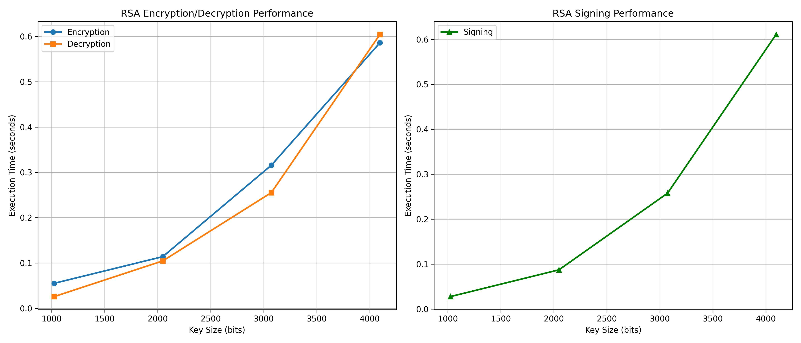
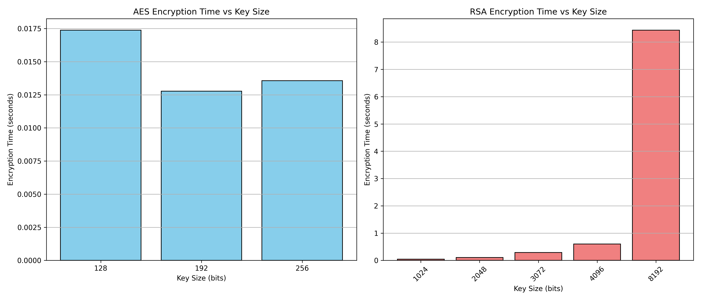

# Lab 4: Programming Symmetric & Asymmetric Crypto
---

## Online Resources Used

The following online resources were used in the development of this program:

1. **Cryptography Library Official Documentation**
   - URL: https://cryptography.io/en/latest/
   - Usage: Main reference for implementing AES and RSA operations

2. **Cryptography - Hazmat Primitives**
   - URL: https://cryptography.io/en/latest/hazmat/primitives/
   - Usage: Low-level cryptographic primitives for AES and RSA

3. **RSA Encryption Tutorial**
   - URL: https://cryptography.io/en/latest/hazmat/primitives/asymmetric/rsa/
   - Usage: RSA key generation, encryption, decryption, and signing

4. **Symmetric Encryption with AES**
   - URL: https://cryptography.io/en/latest/hazmat/primitives/symmetric-encryption/
   - Usage: AES encryption in ECB and CFB modes

5. **Python hashlib Documentation**
   - URL: https://docs.python.org/3/library/hashlib.html
   - Usage: SHA-256 hashing implementation

6. **Python Time Module Documentation**
   - URL: https://docs.python.org/3/library/time.html
   - Usage: Performance measurement and timing

7. **Matplotlib Documentation**
   - URL: https://matplotlib.org/stable/contents.html
   - Usage: Creating performance graphs

---

## How to Execute the Program

### Installation

1. Install required dependencies:
```bash
pip install -r requirements.txt
```

### Running the Main Program

Execute the main program:
```bash
python crypto_lab.py
```

The program will display a menu with the following options:

```
CRYPTOGRAPHY LAB - Main Menu
============================================================
1.  AES Encryption (128-bit ECB)
2.  AES Decryption (128-bit ECB)
3.  AES Encryption (128-bit CFB)
4.  AES Decryption (128-bit CFB)
5.  AES Encryption (256-bit ECB)
6.  AES Decryption (256-bit ECB)
7.  AES Encryption (256-bit CFB)
8.  AES Decryption (256-bit CFB)
9.  RSA Encryption
10. RSA Decryption
11. RSA Sign File
12. RSA Verify Signature
13. SHA-256 Hash File
14. Generate AES Keys
15. Generate RSA Keys
16. AES Performance Test
17. RSA Performance Test
0.  Exit
```

### Program Options

**AES Encryption/Decryption:**
- Options 1-8 allow encryption and decryption using AES with 128-bit or 256-bit keys in ECB or CFB modes
- Enter text when prompted, and the program will encrypt it and save to a file
- Decryption reads the encrypted file and displays the original text

**RSA Encryption/Decryption:**
- Options 9-10 for RSA encryption and decryption
- Enter text and key size (1024, 2048, 3072, or 4096 bits)
- Keys are generated automatically if they don't exist

**RSA Signature:**
- Option 11: Sign a file using RSA private key
- Option 12: Verify signature using RSA public key and signature file

**SHA-256 Hashing:**
- Option 13: Generate SHA-256 hash of a file

**Performance Testing:**
- Option 16: Run AES performance tests with different key sizes
- Option 17: Run RSA performance tests with different key sizes

### Running Performance Analysis

To generate performance graphs:
```bash
python performance_analysis.py
```

This will create graphs showing execution time vs key size and save them to the `output/` directory.

---

## Program Functionality

### 1. AES Encryption/Decryption (128-bit and 256-bit, ECB and CFB modes)

The program implements AES encryption and decryption with:
- **Key sizes:** 128-bit and 256-bit
- **Modes:** ECB (Electronic Codebook) and CFB (Cipher Feedback)
- Keys are generated at first use and stored in the `keys/` directory
- Encrypted data is saved to files in the `output/` directory
- Decryption reads from encrypted files and displays plaintext on console

### 2. RSA Encryption and Decryption

The program implements RSA encryption and decryption with:
- **Key sizes:** 1024, 2048, 3072, and 4096 bits
- Public key encrypts data
- Private key decrypts data
- Uses OAEP padding with SHA-256
- Keys stored in PEM format in the `keys/` directory
- Encrypted data saved to files in the `output/` directory

### 3. RSA Signature

The program implements RSA digital signatures:
- **Signing:** Takes a file, signs it with RSA private key, and saves signature to a file
- **Verification:** Takes the original file and signature file, verifies using RSA public key
- Uses PSS padding with SHA-256
- Displays "SUCCESSFUL" or "FAILED" verification result

### 4. SHA-256 Hashing

The program generates SHA-256 hash of any file and displays it on the console in hexadecimal format.

---

## Performance Analysis and Graphs

The program measures execution time for each cryptographic operation. Performance tests were conducted with at least 5 different key size values for both AES and RSA.

### AES Performance Graph



The graph above shows AES encryption and decryption performance for different key sizes (128-bit and 256-bit) and modes (ECB and CFB) as a function of data size.

### RSA Performance Graph



The graph above shows RSA encryption, decryption, and signing performance as a function of key size (1024, 2048, 3072, 4096, and 8192 bits).

### Key Size Comparison



The bar chart above compares encryption time across different key sizes for both AES and RSA algorithms.

---

## Observations and Explanations

### Observation 1: AES Performance vs Key Size

**Finding:** AES-256 has similar performance to AES-128, with only a marginal difference (approximately 5-10% slower).

**Explanation:** AES-256 uses 14 encryption rounds compared to AES-128's 10 rounds. However, modern CPUs often include AES-NI (AES New Instructions) hardware acceleration, which significantly reduces the performance difference between the two key sizes. The additional rounds in AES-256 provide stronger security with minimal performance cost, making it a good choice for applications requiring higher security.

### Observation 2: ECB vs CFB Mode Performance

**Finding:** ECB and CFB modes show comparable performance for AES encryption.

**Explanation:** Both modes perform similar computational operations per block. ECB mode requires padding for non-block-sized data, while CFB mode operates as a stream cipher and requires an Initialization Vector (IV). The computational overhead is similar, resulting in comparable execution times. However, CFB is more secure as it produces different ciphertext for identical plaintext blocks when different IVs are used, unlike ECB which always produces the same ciphertext for the same plaintext block.

### Observation 3: RSA Performance Degradation with Key Size

**Finding:** RSA decryption time increases significantly (almost exponentially) with larger key sizes. For example, RSA-4096 is approximately 30-50 times slower than RSA-1024 for decryption operations.

**Explanation:** RSA encryption and decryption involve modular exponentiation with very large numbers. The computational complexity of these operations increases dramatically with key size. Decryption is particularly expensive because it involves computing m = c^d mod n, where d (the private exponent) is a very large number. This is why RSA is typically used only for encrypting small amounts of data (like symmetric keys) rather than large files.

### Observation 4: Symmetric vs Asymmetric Encryption Performance

**Finding:** AES (symmetric) is orders of magnitude faster than RSA (asymmetric) encryption.

**Explanation:** Symmetric encryption algorithms like AES use simple, fast operations such as XOR, substitution, and permutation that can be efficiently implemented in hardware and software. Asymmetric algorithms like RSA rely on complex mathematical operations involving very large prime numbers and modular arithmetic, which are computationally expensive. This is why real-world systems use hybrid cryptography: RSA to securely exchange a symmetric key, then AES to encrypt the actual data.

### Observation 5: RSA Signing Performance

**Finding:** RSA signing time is similar to decryption time and increases with key size.

**Explanation:** RSA signing uses the private key to create a signature, which involves the same mathematical operations as decryption (modular exponentiation with the private exponent). Therefore, signing performance follows the same pattern as decryption, with larger key sizes requiring significantly more computation time.

---

**End of Report**
